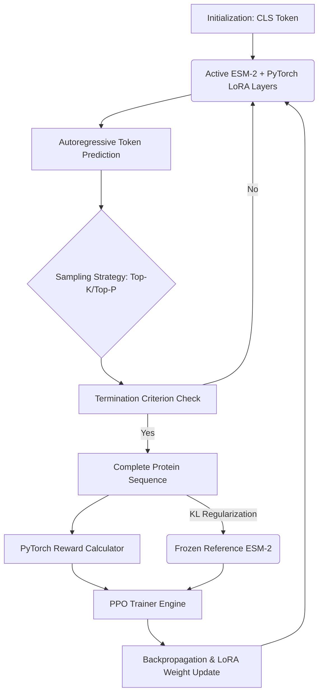
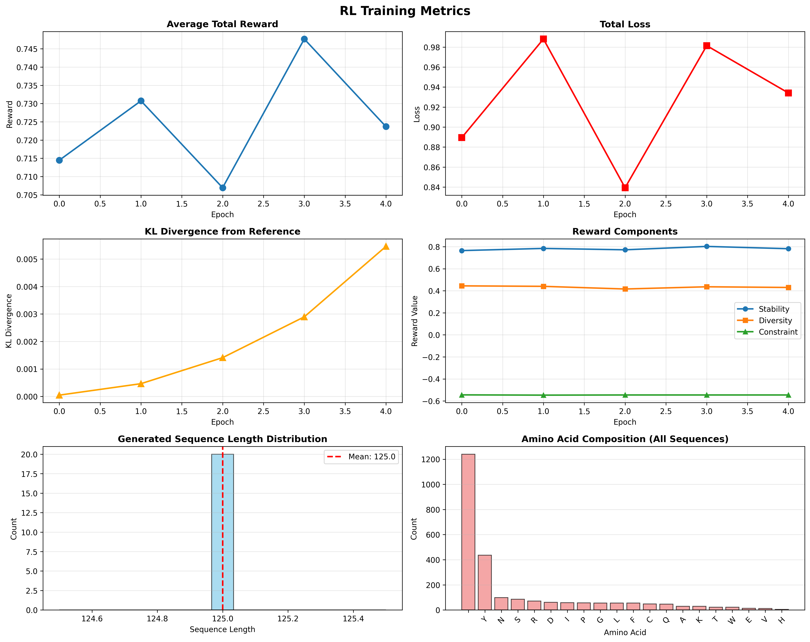

# ESM2-RL Designer: Controllable Protein Design

[](https://www.python.org/downloads/)
[](https://pytorch.org/)
[](https://huggingface.co/facebook/esm2_t33_650M_UR50D)
[](https://github.com/microsoft/LoRA)

ESM2-RL Designer is a high-performance framework dedicated to the protein sequence design. It utilizes Meta AI's ESM-2 (650M) protein language model, fine-tuned through Reinforcement Learning (Proximal Policy Optimization) and LoRA (Low-Rank Adaptation) using PyTorch. The system is designed to generate protein sequences with specific, controllable biological properties.

---

## Overview

Traditional methods for protein design often encounter scalability issues or require extensive physics-based simulations. This framework implements a PyTorch-based steering loop where a pre-trained ESM-2 model is adapted to function as an autoregressive generator. This generator is guided by a multi-objective reward function implemented in PyTorch, optimizing for the following criteria:

1.  **Structural Stability**: Metrics for hydrophobic core enrichment and net charge balance.
2.  **Sequence Diversity**: Shannon entropy-based novelty and edit distance from reference sequences.
3.  **Functional Constraints**: Motif satisfaction and sequence length control.

### Architecture

The following diagram illustrates the reinforcement learning feedback loop implemented using PyTorch and the PEFT library.



---

## Key Features

*   **Autoregressive ESM-2 Implementation**: Strategically modifies the natively Masked Language Model (MLM) architecture to enable robust sequence generation.
*   **Parameter-Efficient Fine-Tuning (PEFT)**: Leverages LoRA to adapt less than 1% of the total model parameters, enabling complex fine-tuning on consumer-grade GPU hardware.
*   **PyTorch-Optimized Training**: Fully utilizes PyTorch's computational graph for efficient gradient updates during the RL process.
*   **Multi-Objective Reward Function**: A sophisticated, weighted reward system designed to balance competing biological requirements.
*   **KL Divergence Regularization**: Maintains biological plausibility by preventing the model from over-optimizing for specific reward signals.
*   **Weights & Biases Integration**: Comprehensive support for real-time experiment tracking and telemetry via WandB.

---

## Installation

### Prerequisites
*   Python 3.8 or higher
*   NVIDIA GPU with CUDA support (Tesla T4 or higher recommended)
*   PyTorch 2.0 or higher

### Setup
```bash
# Clone the repository
git clone https://github.com/varshhhy7/esm2-rl-designer.git
cd esm2-rl-designer

# Install core dependencies including PyTorch and PEFT
pip install torch transformers peft accelerate fair-esm datasets wandb numpy pandas matplotlib seaborn
```

---

## Usage

### Interactive Notebook
For a comprehensive, step-by-step technical walkthrough, please refer to the provided Jupyter Notebook:
`notebooks/Controllable Protein Design via RL Fine-Tuning of ESM-2.ipynb`

### Source Documentation
*   `src/Protein_Generator.py`: Core logic for PyTorch-based sequence generation.
*   `src/rewards.py`: Implementation of multi-objective biological reward signals.
*   `src/PPO.py`: The PPO training engine implemented in PyTorch.

---

## Reward System

The RewardCalculator module evaluates generated sequences based on several critical biological signals:

| Signal | Biological Rationale | Technical Implementation |
| :--- | :--- | :--- |
| **Stability** | Structural fold integrity | Fractional hydrophobic content (~35%) and net charge minimization. |
| **Diversity** | Novelty and exploration | Implementation of Shannon entropy and edit distance metrics. |
| **Constraint** | Sequence validity | Motif satisfaction checks and length-based penalties. |

---

## Results

The PPO-driven fine-tuning process demonstrates a steady convergence of reward signals while preserving the underlying grammar of protein sequences.


*Figure 1: Convergence of reward metrics over training epochs.*

### Sample Output
> `MKTAYIAKQRQISFVKSHFSRQLEERLGLIEVQAPILSRVGDGTQDNLSGAEKAVQVKVKALPDAQFEVVHSLAK`

---

## Technology Stack

The framework is built upon the following core technologies:

*   **Deep Learning Framework**: [PyTorch](https://pytorch.org/) (Handles all tensor operations, model training, and gradient calculations)
*   **Model Backbone**: Meta AI ESM-2 (`esm2_t33_650M_UR50D`)
*   **Optimization**: [PEFT/LoRA](https://github.com/huggingface/peft) (Low-Rank Adaptation for parameter efficiency)
*   **RL Algorithm**: Proximal Policy Optimization (PPO)
*   **Ecosystem**: Hugging Face Transformers and Accelerate
*   **Analysis & Visualization**: WandB, NumPy, Pandas, Matplotlib, and Seaborn

---

## License
This project is licensed under the MIT License.
